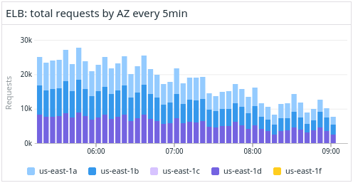

# Datadog library and command line tools

[](https://pypi.org/project/libddog)
[](https://github.com/nearmap/libddog/actions/workflows/github-actions.yml)


libddog lets you define your metrics and dashboards in code and get the full benefit of a programming language to automate your monitoring setup.

First you write the query:

```python
query = (Query("aws.elb.request_count")
        .filter(region="us-east-1")
        .agg("sum").by("availability-zone").as_count()
        .rollup("sum", 5 * 60))

# produces:
#   sum:aws.elb.request_count{region:us-east-1}
#    by {availability-zone}.as_count().rollup(sum, 300)
```

The query language closely resembles the Datadog syntax, but because it's Python code and not just a string it is validated and known to be well formed at definition time.

Then you define what the graph looks like:

```python
Timeseries(
    title="ELB: total requests by AZ every 5min",
    requests=[
        Request(
            queries=[query],
            display_type=DisplayType.BARS,
        ),
    ],
    size=Size(height=3, width=5),
)
```

This gives you the widget you want, with all the parameters supported by the Datadog UI:



Learn more in the **[User guide](docs/USER_GUIDE.md)**.


## The state of the project

libddog is a young project and currently supports a small but useful subset of dashboard functionality. See the **[Feature support](docs/FEATURE_SUPPORT.md)** page for details.

We plan to support more dashboard features over time. We also plan to support monitors.

Want to know what's new in the project? Read the **[CHANGELOG](CHANGELOG.md)**.

Want to contribute? Start by reading the **[Maintainer guide](docs/MAINTAINER_GUIDE.md)**.


## Why libddog?

Monitoring tools like Datadog make it easy to experiment with different metrics and widgets, and create dashboards for many different visualizations of your systems. This is great for prototyping your monitoring setup, but it is not great for maintainability. Over time, as your team accumulates dashboards, they become a maintenance burden. Many of the graphs stop working because the metrics have changed, or the data shown isn't correct anymore. The enthusiasm that goes into creating the dashboards typically doesn't extend to maintaining their whole lifecycle. And let's be fair: it is not especially fun to manually change 20 graphs on a dashboard to update the name of a metric, change a tag, or update the aggregation or rollup parameters.

The thing is - in order to remain useful your dashboards need to keep pace with the continuous change in your systems. How can we make this easier?

Well, how do we manage this change in our systems? We architect our systems. We strive for single source of truth, modularity and code reuse. Why should we not do the same with our monitoring architecture? 

How would we apply these ideas to dashboards?

Let's start by defining the name of the metric in one place and reuse that. Every graph on every dashboard should use this definition when doing anything with service request counts:

```python
service_requests = Query("service.request_count")
```

Next, we'll be consuming this metric in different ways depending on the use case. One use case is to count all service requests across our nodes. To do this we need to aggregate by `sum`. In the same breath we should also think about the rollup, because the rollup is an aggregation over time. So let's make sure they are consistent:

```python
service_requests_totals = service_requests.as_count().agg("sum").rollup("sum")
```

We now have a reusable use case in `service_requests_totals` that we can consume in many different graphs.

On one dashboard we might have a template variable that filters by region. So for this dashboard we'll add the template variable to our query:

```python
query = service_requests_totals.filter("$region")
```

We might have another dashboard that is specific to a particular region, eg. `us-east-1`. In this case we'll want to filter on that region directly:

```python
query = service_requests_totals.filter(region="us-east-1")
```

Finally, we want to graph this metric. At this point we have a choice to make - we can visualize just one single number that represents all requests to our service globally, or we can break down the request totals by some dimension like availability zone:

```python
Timeseries(
    title="Total service requests by AZ",
    requests=[
        Request(
            queries=[query.by("availability-zone")],
            display_type=DisplayType.BARS,
        ),
    ],
    ...
)
```

Notice that every decision about how to construct the query represents a different concern:

- Is the metric a count or a rate?
- Does it represent a sum or an average, min or max?
- What dimensions do we filter on?
- What dimensions do we group by?

You can structure your code to answer these questions where it most makes sense, depending on what the code is responsible for. A function that applies a particular filter to queries (eg. a template variable) can apply it consistently to any number of queries. This is how we can achieve consistency on our dashboards:

```python
class ServiceDashboard:
    def apply_tmpl_var_to_all(self, queries):
        return [query.filter("$region") for query in queries]
```
